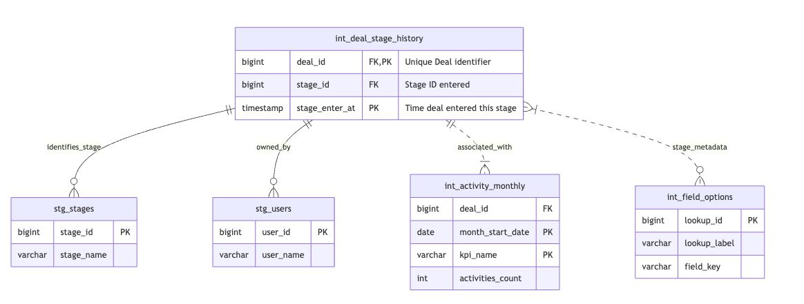

# Pipedrive CRM Sales Funnel Analytics

This project implements a **PostgreSQL and dbt-based analytics pipeline** designed to transform raw Pipedrive CRM event data into a robust, realiable, monthly aggregated sales funnel mart. The solution prioritizes data quality, maintainability, and query efficiency addressing the project requirements.

---

### 🛠️ Project Setup and Configuration Summary

This project was established with a production mindset:

* **Structure:** All core dbt files (`models/`, `macros/`, `dbt_project.yml`) are consolidated into a single **`dbt/`** directory.
* **Layering:** The `models/` directory is structured into **`staging/` (Views)**, **`intermediate/` (Views)**, and **`marts/` (Tables)** to enforce logical separation and cost-efficiency.
* **Security:** Essential files (`profiles.yml`, `.user.yml`) are correctly excluded in the `.gitignore` file to protect credentials and local overrides.
* **Environments:** The `profiles.yml` was updated to define separate **`dev`** and **`prod`** environments, enabling clear CI/CD deployment paths.


## 🧭 Core Architecture and Data Flow

The architecture follows the **Medallion Pattern (Staging → Intermediate → Marts)**.

### Separation of Concerns

* **Raw Data:** All raw data resides in the `postgres_public` schema in PostgreSQL.
* **Staging Layer (`staging/`):** Acts as the cleaning layer. It renames columns, casts IDs to **BIGINT** (for scale), and ensures basic type check validation, materialized as view for low-cost.
* **Intermediate Layer (`intermediate/`):** Solves the core business logic. This is where we convert the chronological event log into a continuous stage timeline using **PostgreSQL Window Functions LEAD()** and flatten complex JSON metadata.
* **Marts Layer (`marts/`):** The final aggregated output, ready for the BI tool.

---

## 💡 Key Assumptions & Design Decisions

* **1. Primary Data Source:** Assuming the raw data resides in the PostgreSQL schema named **`postgres_public`**.
* **2. ID Casting:** All primary keys (PKs) and foreign keys (FKs) are cast to **BIGINT** in the staging layer to ensure future scalability.
* **3. Materialization Strategy:**
    * `staging/` and `intermediate/`: Materialized as **Views** (cost efficiency).
    * `marts/`: Materialized as **Incremental Tables** (performance and scale).

---

### Data Model ERD



## 🛡️ Data Quality Strategy

Data quality is enforced using a multi-layered testing strategy that ensures correctness at low cost.

### Testing Strategy

| Layer | Test Focus | Key Test (Gatekeeper) | Rationale |
| :--- | :--- | :--- | :--- |
| **Source/Raw** | **Freshness Check** (`dbt source freshness`) and **Volume Anomaly Check** (`dbt-expectations`). | Catches external pipeline failures (e.g., zero-row loads). |
| **Staging/Intermediate** |  **Window Function Validation:** Custom test ensuring `stage_exit_at` and `stage_enter_at` validity | Ensures the complex `LAG()` logic is correct. |
| **Marts (Final Report)** | **Incremental PK Check:** Runs a partial uniqueness check on `month`, `kpi_name` using a `WHERE` clause **to limit scanning to the current/last month.** | **Scalability:** Prevents scanning the entire multi-year mart every day(cost effectiveness) |

---

### 🛠️ Custom Macros and Governance Logic

This section documents the specific code built to ensure data quality and maintainability, emphasizing **DRY principles** and **scalable testing**.

#### 1. Macro

This macro standardizes text formatting, which is critical for ensuring clean joins and accurate reporting when unifying data from different sources (Stages, Activity Types, and Metadata JSON).

| Macro | Location | Purpose |
| :--- | :--- | :--- |
| **`standardize_text`** | `macros/standardize_text.sql` | **Text Cleaning and Standardization.** Applies functions like `LOWER()`, `TRIM()`, and `INITCAP()` centrally to create clean, consistent labels (e.g., transforming 'qualified lead' to 'Qualified Lead'). This is used across all models feeding the final `kpi_name` column. |

#### 2. Data Integrity Gatekeepers (Singular Tests)

We rely on highly portable **Singular Tests** (raw SQL files) to execute checks that are too resource-intensive or complex for generic macros.

| Test / Check | Location | Purpose |
| :--- | :--- | :--- |
| **Source Date Check** | `tests/source_deal_changes_no_future_dates.sql` | **Domain Integrity.** Ensures that the `change_time` in the raw source is not set unreasonably far into the future (e.g., more than 10 days ahead). This catches critical data entry errors that would corrupt trend reports. |
| **Logic Check** | `tests/int_stage_exit_after_entry.sql` | **Transformation Logic Validation.** A critical check ensuring that for closed deals, the `stage_exit_at` timestamp is always $\ge$ the `stage_enter_at` timestamp. This validates the correctness of the complex $\text{LEAD()}$ window function. |
| **Incremental PK Check** | `models/marts/marts.yml` | **Scalable Uniqueness.** We use `dbt_utils.unique_combination_of_columns` with a **`WHERE` clause** to run the Primary Key check only on the current and previous month's data. This saves significant compute cost by avoiding full-table scans. |
---


## 📈 Answering the Business Questions

The final reporting model, `sales_funnel_monthly`, is structured to directly answer the assessment's key performance indicators (KPIs) and required funnel steps by unifying complex metrics.

* **Funnel Steps (1.0, 2.0, 4.0, etc.):** Derived by counting distinct deals entering a stage from the `int_deal_stage_history` model.
* **Activity Steps (2.1, 3.1):** Derived by counting completed calls from the `int_activity_monthly` model.

* **Additional Metrics/Analyis**
* **Velocity Tracking**: The `int_deal_stage_history` model provides precise `stage_enter_at` and `stage_exit_at` timestamps, enabling analysts to calculate Time-in-Stage and Overall Deal Velocity.

* **Conversion Flexibility**: The model supports calculating Conversion Rates between any two steps in the funnel (e.g., from Qualified Lead to Closing), even non-sequential steps, by relying on the aggregated counts in the final mart.

---
## **Code Success Snippets


---


---


---

## 🛠️ Quick Start Guide

To initialize and test the project:

1.  **Clone the Repo** and navigate to the project directory.
2.  **Install:** `pip install dbt-core dbt-postgres`
3.  **Setup DB:** Ensure your local PostgreSQL instance is running and raw CSV data is loaded into the **`raw`** schema.
4.  **Initial Load & Build:**
    ```bash
    dbt deps
    dbt build 
    ```
5.  **View Lineage:** `dbt docs generate && dbt docs serve`